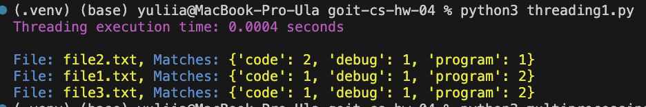
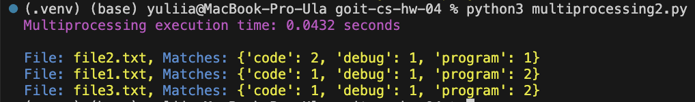

# Домашнє завдання до модуля “Конкурентність та паралелізм”

Привіт 😉

Сьогодні в рамках домашнього завдання ви застосуєте концепції багатопроцесорного
та багатопотокового програмування для розробки ефективної програми паралельного
пошуку заданих ключових слів у текстових файлах.

У процесі виконання ви:

- навчитеся працювати з файлами в контексті багатопотокового та
  багатопроцесорного програмування;
- зрозумієте, як розподіл завдань на потоки або процеси впливає на
  продуктивність і ефективність обробки даних.

Це завдання не лише поглибить розуміння багатопотокового та багатопроцесорного
програмування, дозволить порівняти ефективність обох підходів, але й надасть
практичні навички використання цих концепцій для оптимального розподілу завдань
і використання ресурсів у програмах.

### Підготовка та завантаження домашнього завдання

1. Створіть публічний репозиторій `goit-cs-hw-04`.

2. Виконайте завдання та відправте його у свій репозиторій.

3. Завантажте робочі файли на свій комп’ютер та прикріпіть їх у LMS у форматі
   `zip`. Назва архіву повинна бути у форматі `ДЗ4_ПІБ`.

4. Прикріпіть посилання на репозиторій `goit-cs-hw-04` та відправте на
   перевірку.

### Формат оцінювання

- Оцінка від 0 до 100.

> [!NOTE]
>
> 👉🏻 Якщо є помилки або недоліки виконання, кількість балів за кожне завдання
> зменшується пропорційно до наявних помилок на розсуд ментора.

> [!TIP]
>
> 💡 Відправляйте ДЗ на перевірку, коли зроблено все можливе, оскільки кількість
> спроб здачі завдання впливає на отриманий бал! За кожну наступну спробу після
> другої (тобто з третьої) максимальна можлива кількість балів зменшується на 5.
> Критерії оцінювання робіт у магістратурі GoIt Neoversity

> [!IMPORTANT]
>
> ☝🏻 УВАГА!! У вас є можливість обрати підхід до виконання та можливого
> доопрацювання домашнього завдання:
>
> 1. задовольнитися першою отриманою оцінкою (звісно ж, якщо вона вище
>    прохідного бала),
> 2. намагатися отримати вищий бал шляхом можливого послідуючого доопрацювання
>    роботи у відповідності з фідбеком ментора.
>
> Обраний підхід до виконання ДЗ необхідно зазначити у полі для здачі до
> прикріпленого завдання. За відсутності коментаря ментор дотримується першого
> підходу й виставляє отриману оцінку.

### Формат здачі

- Прикріплені файли репозиторію у форматі `zip` з назвою ДЗ4_ПІБ.
- Посилання на репозиторій.

## Технiчний опис завдання

Розробіть програму, яка паралельно обробляє та аналізує текстові файли для
пошуку визначених ключових слів. Створіть дві версії програми: одну — з
використанням модуля `threading` для багатопотокового програмування, та іншу — з
використанням модуля `multiprocessing` для багатопроцесорного програмування.

### Покрокова інструкція

1. Реалізація багатопотокового підходу до обробки файлів (використовуючи
   `threading`):

- Розділіть список файлів між різними потоками.
- Кожен потік має шукати задані ключові слова у своєму наборі файлів.
- Зберіть і виведіть результати пошуку з усіх потоків.

2. Реалізація багатопроцесорного підходу до обробки файлів (використовуючи
   `multiprocessing`):

- Розділіть список файлів між різними процесами.
- Кожен процес має обробляти свою частину файлів, шукаючи ключові слова.
- Використайте механізм обміну даними (наприклад, через `Queue`) для збору та
  виведення результатів пошуку.

### Критерії прийняття

- Реалізовано багатопотоковий та багатопроцесорний підходи до обробки файлів.
- Забезпечено розподілення файлів між потоками/процесами.
- Код вимірює та виводить час виконання для кожної з версій.
- Забезпечено обробку помилок і винятків, особливо при роботі з файловою
  системою.
- Обидві версії програми повертають словник, де ключ — це пошукове слово, а
  значення — список шляхів файлів, де це слово знайдено.

> [!WARNING]
>
> Критерії прийняття домашнього завдання є обов’язковою умовою оцінювання
> домашнього завдання ментором. Якщо якийсь з критеріїв не виконано, ДЗ
> відправляється ментором на доопрацювання без оцінювання. Якщо вам “тільки
> уточнити”😉 або ви “застопорилися” на якомусь з етапів виконання— звертайтеся
> до ментора у Slack

### Результат виконаного завдання № 1

### Результат виконаного завдання № 2

